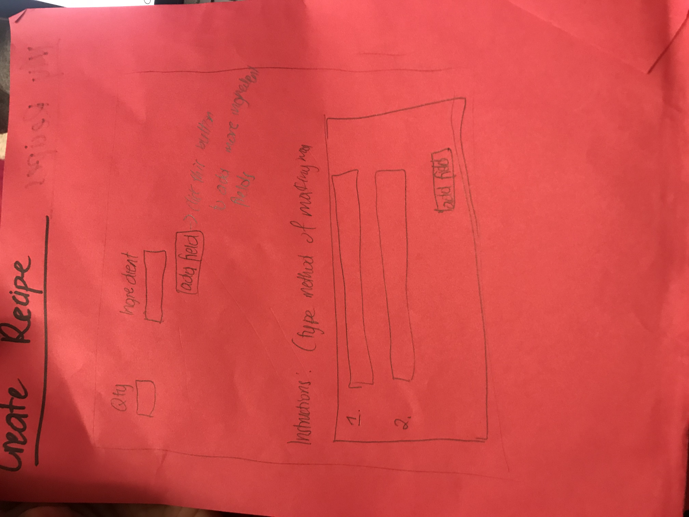

# Find My Recipe

## Overview

Have you ever had random ingredients in your kitchen and not known what to cook with them (if there's anything you can even cook with them)? Have you ever wanted to make something and had to make that painful trip to the grocery store just to get the additional ingredients? Find My Recipe is a way to find a recipe for your ingredients so you may not have to find ingredients for your recipe. 

Find My Recipe will allow users to enter the ingredients they have in their possession and suggest recipes that utilize the exact ingredients. Users can create their own recipes for future usage. 


## Data Model


The application will store Users, and Recipes

* There will be built-in recipes accessible by every user
* Users can create their own recipes (and possibly share them with other users/ make them public)
* Each Recipe will have a list of ingredients, and instruction manual attached to it

An Example User:

```javascript
{
  username: "iNeedARecipe",
  hash: // a password hash,
}
```

An Example Recipe:

```javascript
{
name: Dad's sphaghetti
  Ingredients: [{qty: 1 pound name: sphaghetti},{qty: 2 pounds, name: lean ground beef}, {qty: 1, name: onion minced}, qty: 1 (6 ounce can) name: tomato paste}, {qty: 2 cans, name: condensed tomato soup}, {qty: 2 1/2 cups, name: water}]
  
instructions: "Bring a large pot of lightly salted water to a boil. Add pasta and cook for 8 to 10 minutes or until al dente; drain.
In a large skillet over medium heat, cook ground beef with onion until meat is brown. Drain. Return meat mixture to pan with tomato paste, tomato soup and water. Cook, stirring, until heated through and thickened, 5 to 15 minutes. Serve over cooked pasta."
  createdAt: // timestamp
}
```


## [Link to Commented First Draft Schema](db.js) 


## Wireframes


/home - page to navigate to other pages


/findrecipe - page to enter ingredients to find matching recipe


/createrecipe - page to add a new recipe to the database



/myrecipes - page for showing recipes made


## Site map

The home page will link to /findrecipe, /create, and /myrecipes

All pages should be able to go back to home. 
The /findrecipe will link to recipe pages.

## User Stories or Use Cases

1. As a non-registered user, I can list what's in my fridge and get recipe suggestions, but data will not be saved.
2. As a non-registered user, I can register for  a new account on the website.
3. As a user, I can create new recipes for public or personal viewing. 
4. As a user, I can keep track of the recipes I've created or made. 

## Research Topics


* Integrate user authentication
    * I'm going to be using passport for user authentication
    * An account has been made for testing; I'll email you the password

* Perform client side form validation using a JavaScript library


## [Link to Initial Main Project File](app.js) 


## Annotations / References Used

1. [passport.js authentication docs](http://passportjs.org/docs) - (add link to source code that was based on this)
2. [tutorial on vue.js](https://vuejs.org/v2/guide/) - (add link to source code that was based on this)

